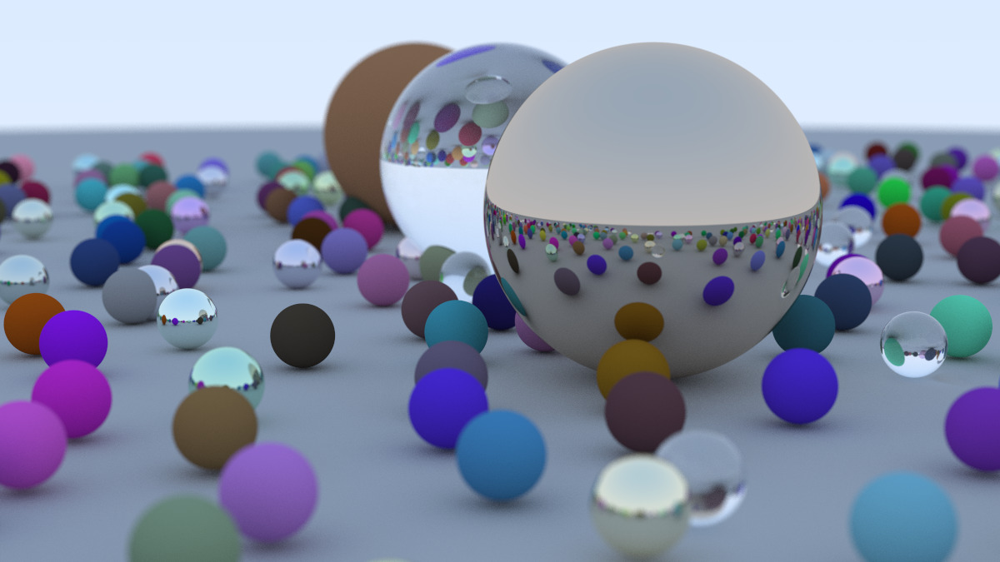

This is a code for learning ray tracing with [Ray Tracing in One Weekend](https://raytracing.github.io/books/RayTracingInOneWeekend.html).

How to run:

```sh
cargo run --release
```

This command generates `out.ppm`. Open it by your image viewer.

Example of the rendered result:


